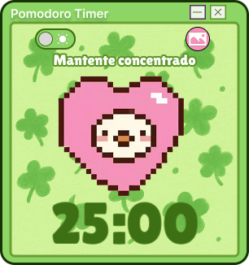
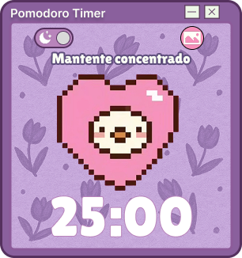
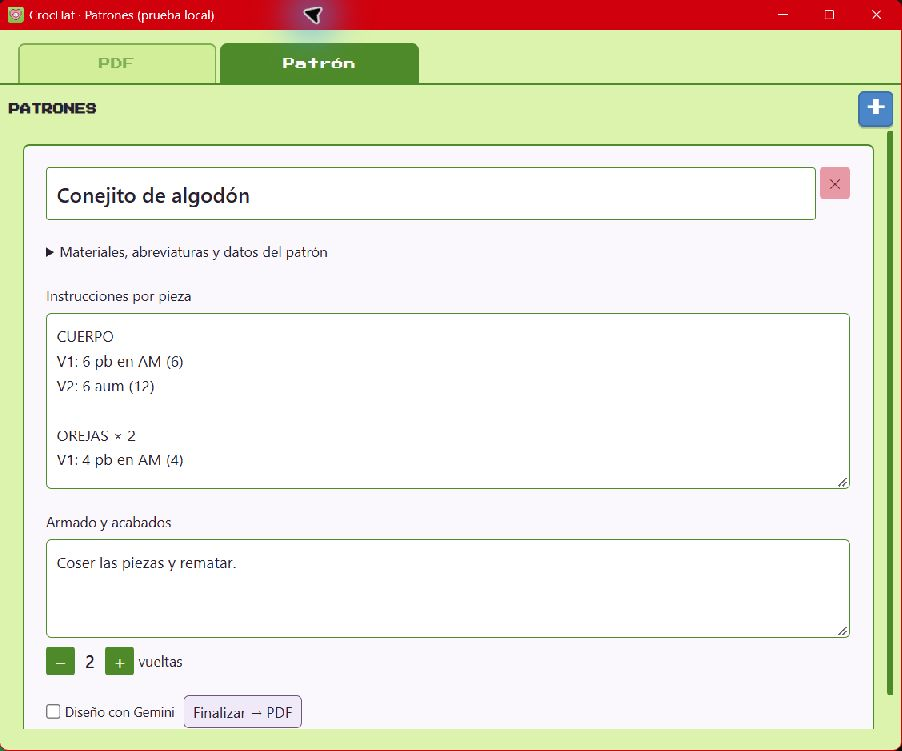
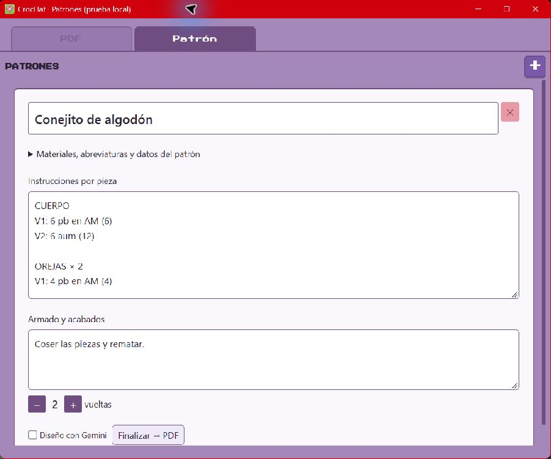
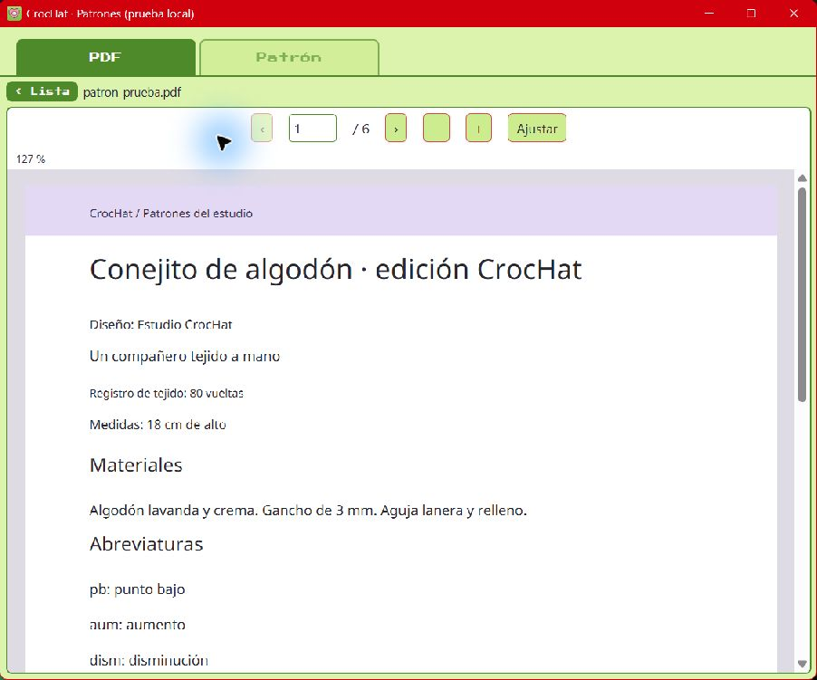

<div align="center">

# CrocHat 🧶🍅

**Un espacio cozy para tejer, concentrarte y dar forma a tus patrones.**

Pomodoro pixel-art · Biblioteca PDF · Contador de vueltas · Patrones propios

[Conoce las novedades](#lo-nuevo-en-crochat) · [Primeros pasos](#tu-primera-sesión) · [Compilar para Windows](#compilar-para-windows)

</div>

CrocHat acompaña tus sesiones de crochet desde una pequeña ventana flotante:
organiza tus tiempos, consulta un patrón y lleva tus vueltas sin perder el hilo.
Cuando necesitas más espacio, abre los patrones en su propia ventana y acomódala a tu gusto.

<p align="center">
  
  
</p>

## Lo nuevo en CrocHat

| Novedad | Para tu próxima sesión |
| --- | --- |
| 🪟 **Patrones en otra ventana** | Separa el panel, maximízalo o cambia su tamaño mientras el temporizador sigue a mano. |
| 📖 **Un visor PDF más cómodo** | Acerca los detalles, ajusta al ancho, salta a una página y retoma la última que leíste. También abre patrones escaneados. |
| 📝 **Tus patrones, mejor organizados** | Añade materiales, abreviaturas, tamaño, autoría, instrucciones por pieza y armado. |
| ✨ **De tus notas a un PDF** | Pulsa «Finalizar → PDF» para exportar con tipografía legible, colores pastel y páginas ordenadas. |
| 💾 **Guardado más cuidado** | Notas con identidades únicas, biblioteca sin rutas repetidas y espera del guardado al cerrar. |

> 🚧 Estas novedades están en la rama `codex/patterns-and-persistence` y el [PR #1](https://github.com/vhhatziry/crochat-pomodoro/pull/1), todavía en borrador. El instalador de prueba se ha compilado localmente; aún no está publicado como una Release de GitHub.

## Tu primera sesión

1. Abre CrocHat, elige **Verde 💚** o **Morado 💜** y empieza un Pomodoro.
2. Entra en **Patrones → PDF → Añadir PDFs** para elegir tus documentos.
3. Pulsa **↗ Ventana** si quieres leer en grande o colocar el patrón junto a tu trabajo.
4. En la pestaña **Patrón**, escribe tus instrucciones y lleva el contador de vueltas.
5. Cuando esté listo, pulsa **Finalizar → PDF** y elige dónde guardarlo.

El temporizador, la biblioteca, las notas y la exportación funcionan **sin conexión**.
El diseño opcional con Gemini requiere configuración e Internet.

## Así se ve el espacio de patrones

El editor en **Verde (modo claro)** y **Morado**, con campos claros y texto oscuro
para leer las instrucciones con comodidad. Las capturas usan un patrón de ejemplo.

<p align="center">
  
  
</p>

**Un PDF a mano mientras tejes.** La ventana independiente permite ampliar el visor;
los controles de página y zoom acompañan la lectura. Este documento se exportó desde CrocHat.

<p align="center">
  
</p>

## Pequeños detalles que acompañan

- ⏱️ **Temporizador Pomodoro** con máquina de estados (`Idle → Working → ShortBreak → LongBreak`).
  Ciclos por defecto **25 / 5 / 15 min** y descanso largo cada 4 pomodoros.
- 🔔 **Notificación nativa** de Windows al terminar cada ciclo, con cambio automático de fase.
- 🧶 **Contador de vueltas y notas locales** para retomar tus proyectos después de cerrar la app.
- 🎨 **Dos temas** (Verde con tréboles / Morado con flores). La preferencia se persiste.
- 🪟 **Comportamiento de widget**: sin decoraciones, transparente (esquinas redondeadas),
  siempre encima, recuperable desde la barra de tareas al minimizar. Abrirlo de nuevo restaura la instancia existente.

## Desarrollo local

Construido con **Tauri 2 · Rust · TypeScript · Vite**, con **PDF.js** para leer documentos
y **jsPDF** para exportar tus patrones.

### Requisitos

- **Node.js** ≥ 22.13 y **pnpm** (PDF.js 6 requiere esta versión de Node).
- **Rust** (toolchain estable) — https://rustup.rs
- **Windows con WebView2 Runtime**. Si hiciera falta, está disponible en
  [Microsoft WebView2](https://developer.microsoft.com/microsoft-edge/webview2/).

### Puesta en marcha

```bash
pnpm install           # dependencias del frontend + CLI de Tauri
pnpm tauri dev         # arranca el widget en modo desarrollo
```

La primera compilación de Rust descarga y construye Tauri, así que tarda unos minutos.

## Compilar para Windows

```bash
pnpm tauri build
```

Genera dos salidas:

| Salida | Ruta |
| --- | --- |
| **Binario portable** (un solo `.exe`, self-contained salvo WebView2) | `src-tauri/target/release/crochat.exe` |
| **Instalador NSIS** | `src-tauri/target/release/bundle/nsis/CrocHat_0.1.0_x64-setup.exe` |

Para distribuir el widget portable basta con copiar **`crochat.exe`**: los assets del frontend
van embebidos en el binario. La máquina destino necesita **WebView2 Runtime**.

El perfil `release` está optimizado para tamaño en `src-tauri/Cargo.toml`
(`opt-level = "z"`, `lto = true`, `codegen-units = 1`, `strip = true`, `panic = "abort"`).

## Diseño opcional con Gemini

En una terminal PowerShell, configura las variables **antes** de iniciar la aplicación:

```powershell
$env:GEMINI_API_KEY = "tu-clave-de-API"
$env:GEMINI_MODEL = "modelo-disponible-en-tu-cuenta"
pnpm tauri dev
```

Obtén la clave y consulta los modelos de tu cuenta en [Google AI Studio](https://aistudio.google.com/).
La integración usa la [API oficial generateContent](https://ai.google.dev/api/generate-content).
La clave se lee en Rust y no se guarda en las notas ni se incorpora al ejecutable.
Activa «Diseño con Gemini» en un patrón y pulsa «Finalizar → PDF»: el título y las notas se
envían a Gemini para elegir un subtítulo y una paleta. El texto de tejido, las vueltas y
los puntos del PDF vienen de tus notas originales. Sin clave, puedes exportar desactivando
la casilla. Cancelar el selector no borra el patrón. Los PDFs se guardan donde elijas;
añádelos a la biblioteca con «Añadir PDFs».

## Cómo funciona el espacio de patrones

En el panel, «↗ Ventana» abre los PDF y el editor en una ventana independiente de
900 × 720 px. Tiene los controles normales de Windows para maximizar, minimizar y
redimensionar desde los bordes. El temporizador conserva su tamaño de widget.
«↗ Ver ventana» enfoca la misma ventana, sin abrir más copias. Al cerrarla se espera
al guardado y se recarga el panel del temporizador. Solo la ventana independiente
puede editar la biblioteca mientras está abierta, para evitar sobrescribir cambios.

Los patrones propios admiten autoría, tamaño final, materiales, abreviaturas,
instrucciones por pieza y armado/acabados. Los campos nuevos son opcionales y se
incluyen en el PDF; las notas antiguas siguen funcionando. El visor también muestra
PDFs hechos de imágenes, aunque esos documentos no tengan texto seleccionable.

## Guardado y pruebas

Los datos están en `crochat-store.json` dentro del directorio de datos de Tauri; este
repositorio no utiliza una base SQL. Los patrones nuevos usan UUID. Al cargar IDs antiguos
repetidos se asigna una identidad distinta a cada nota, sin borrar ni combinar contenidos.
El guardado escribe snapshots en orden y cerrar espera a que terminen. Un fallo de lectura
no habilita una biblioteca vacía para sobrescribir tus datos. Solo se admite una instancia.

```bash
pnpm test  # regresiones del guardado, IDs y rutas Windows
pnpm build
cargo check --manifest-path src-tauri/Cargo.toml
cargo test --manifest-path src-tauri/Cargo.toml --lib
```

Prueba manual en Windows: crea dos notas, cambia de pestaña inmediatamente después de
escribir, cierra y reabre; verifica sus textos y contadores. Minimiza y restaura desde
la barra de tareas; abrir otro ejecutable debe enfocar la ventana existente. Abre PDFs
de varias páginas, usa zoom y cambia de documento rápidamente. Exporta un patrón largo,
cancela otra exportación y prueba Gemini con/sin clave. La integración real con Gemini
requiere credenciales; no se ejecuta durante las pruebas offline.

## Regenerar sprites

Los sprites pixel-art se generan por código (sin dependencias nativas):

```bash
node tools/gen-sprites.mjs
```

Escribe los PNG en `src/assets/sprites/` y el icono fuente en `src-tauri/icons/icon-source.png`.
Para regenerar el set de iconos de la app tras cambiar el fuente:

```bash
npm run tauri icon src-tauri/icons/icon-source.png
```

> Son aproximaciones del diseño de Figma; puedes reemplazar cualquier PNG de `src/assets/sprites/`
> por el export exacto sin tocar código.

## Estructura

```
src/
  main.ts                 orquestador: monta vistas + controles de ventana
  timer/pomodoro.ts       máquina de estados del Pomodoro (toda la lógica de tiempo)
  store/persistence.ts    wrappers de los comandos Rust del store
  notify.ts               notificaciones nativas
  ui/
    titlebar.ts           barra pixel con arrastre + minimizar/fijar/cerrar
    timerView.ts          corazón + display MM:SS + contador
    patronesView.ts       CRUD de patrones (persistente)
    patternsPanel.ts      biblioteca PDF + editor + ventana independiente
    closeGuard.ts         espera de guardado antes de cerrar
    nav.ts                conmutador de vistas
    theme.ts              toggle Verde/Morado + persistencia
  styles/                 base (reset+fuente), themes (variables), widget (layout)
  assets/fonts|sprites    Press Start 2P (OFL) + PNGs pixel-art
  pdf/
    reader.ts             visor PDF.js con zoom y navegación
    document.ts           diseño y exportación de patrones a PDF
src-tauri/
  src/lib.rs              comandos: save/load patrones, save/load tema, notify
  tauri.conf.json         ventana widget + bundle
  Cargo.toml              perfil release optimizado
tools/gen-sprites.mjs     generador de sprites (encoder PNG con zlib nativo)
```

## Controles

- **Barra de título**: arrástrala para mover el widget. `_` minimiza · `📌` fija/desfija "siempre encima" · `✕` cierra.
- **Fila de controles**: la píldora cambia de **tema**, el círculo central es **play/pausa**,
  el botón rosa alterna entre **Temporizador** y **Patrones**.

## Créditos

- **Idea, diseño y creación:** [vhhatziry](https://github.com/vhhatziry) 💚🧶
- Diseño CrocHat en Figma (por vhhatziry).
- Fuente **Press Start 2P** por CodeMan38 — licencia **OFL** (`src/assets/fonts/OFL.txt`).
- Fuente **Noto Sans** para los PDFs — licencia **OFL** (`src/assets/fonts/noto/LICENSE`).
